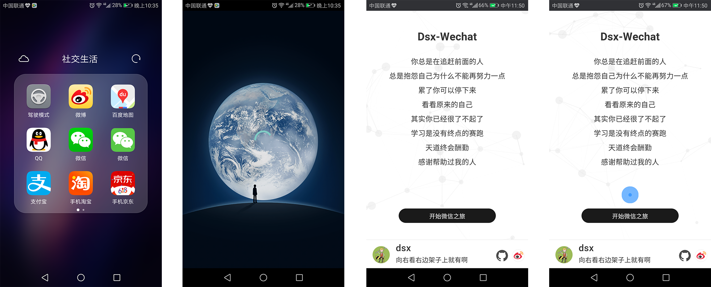
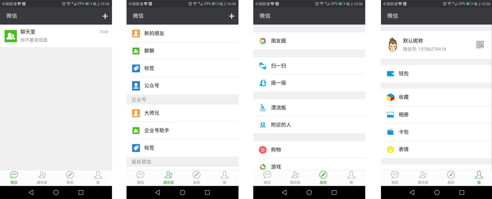

# Dsx_wechat

* 这是一个 Vue 仿微信客户端
* Github项目地址：[https://github.com/GGwujun/Dsx_wechat](https://github.com/GGwujun/Dsx_wechat)
* 一款模仿微信的 Web App，具有真实的聊天等功能，并采用前后端分离的方式来实现。前端基于 Vue 2.0 框架，[后端](https://github.com/GGwujun/chatserve)基于 Node.js + Express + MongoDB，聊天功能和添加好友功能通过 Websocket 实现。
* 欢迎关注我的公众号：
* 前端技术栈: vue 2.0、vue-cli、vuex、vue-router、webpack 2.x、pug、sass、babel等；
* 后端技术栈：Node.js、Express、express-session、WebSocket(ws)、MongoDB、mongoose、ES6等。


### Intro
* 学习vue有段时间了，但是公司并不使用vue，为了练习vue大大小小也做过几个个人项目，模仿过微信的pc版，由于sockit.io不能刷新，导致在pc端体验并不好，一刷新就要重新登陆才可以发消息给好友。
* 在公司用的多的就是ionic，一个专注于移动端webapp的偏UI框架，里面也用到了angularjs框架。打包用的是cordova，后面就想到了用vue做一个微信客户端，用cordova打包。
* 目前手机的硬件已经很好了，基本cordova打包的app体验还是很流畅的，配合vue的单页面应用基本可以无差原生app了。
* 前端部分使用 vue-cli 构建、打包, 配合 vue全家桶（vue、vuex、vue-router）进行编码
* 使用 axios 进行资源请求
* 后台使用 Node.js的express架构开发，目前接口不多，不过会持续更新。

### Server
* 使用 Nodejs + Express 开发
* 实现 注册，登录，退出登录，查看好友，个人主页，添加好友，一对一聊天和群聊
* Github项目地址：[https://github.com/GGwujun/chatserve](https://github.com/GGwujun/chatserve)

### Preview



### 下载apk

[点击这里下载安装apk](./screenshots/android-armv7-debug.apk)，目前只支持android（5.0以上）系统（由于项目仍在开发中，部分功能可能不是最新、或暂不可用）。

新用户必须通过注册账号进入，已注册用户可直接登录进入。目前占不支持离线消息，也不支持添加离线用户为好友（即时通信相关功能必须保证对方在线）

### 本地使用

假设你已安装 `Node.js`，那么直接克隆仓库到本地，安装完所有插件并启动服务器。
建议使用谷歌浏览器并在手机调试模式下查看(http://localhost:8808/)。

``` bash
# clone
git clone https://github.com/GGwujun/Dsx_wechat.git

# 进入到目录 安装所有依赖包 国内建议使用cnpm
cd Dsx_wechat
npm install

# 开启本地服务器 监听8808端口
npm run dev
```

### Tips
* 无法注册或者获取数据，因为我配置的后台接口是我的服务器，你可以自己下载后台代码，部署到自己服务器，不过一般情况是可以访问的。
* 如果你要自己搭建服务器，你除了要安装node相关的依赖外，你还需要安装MongoDB数据库


### function

该项目已实现后端服务器的支持，具有真实的聊天功能。后端部分请转移[这里](https://github.com/GGwujun/chatserve)

- 高仿微信客户端的界面设计风格，具有push、pop、modal、dismiss等转场动画；
- 注册、登陆和注销功能，可记住登录状态，避免多次登录；
- 聊天室功能，所有在线用户可进行群聊；
- 添加好友，目前必须保证对方在线才能正确添加；
- 用户私聊，目前必须保证对方在线方可正常聊天；
- 目前只支持纯文本聊天。

更多功能请待续...


如果您觉得该项目不错, 欢迎**star**和分享！
